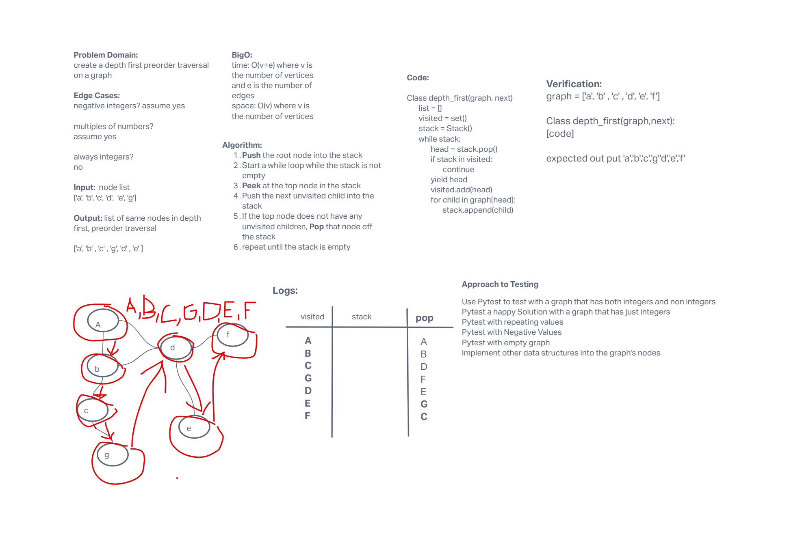

# Depth First Traversal
- [PR Link]()

> "Depth First Search (DFS) algorithm traverses a graph in a depthward motion and uses a stack to remember to get the next vertex to start a search, when a dead end occurs in any iteration." - [tutorialspoint](https://www.tutorialspoint.com/data_structures_algorithms/depth_first_traversal.htm)

## Challenge
Extend Graph Implemntation with Depth First Traversal:

- Name: Depth first
- Arguments: Node (Starting point of search)
- Return: A collection of nodes in their pre-order depth-first traversal order
- Program output: Display the collection

## Whiteboard

## Approach & Efficiency
- Time: O(v+e) where v is the number of vertices and e is the number of edges
- space: O(v) where v is the number of vertices
- [Tests](tests/test_graph_depth_first.py)

## Credits and Colaborations
- [Graphs in Python: Depth-First Search (DFS) Algorithm](https://stackabuse.com/depth-first-search-dfs-in-python-theory-and-implementation/)
- [Iterative Depth First Traversal of Graph](https://www.geeksforgeeks.org/iterative-depth-first-traversal/)
- [Depth First Search Using Stack in Python](https://codereview.stackexchange.com/questions/247368/depth-first-search-using-stack-in-python)
- [Graphs](https://codefellows.github.io/common_curriculum/data_structures_and_algorithms/Code_401/class-35/resources/graphs.html)
