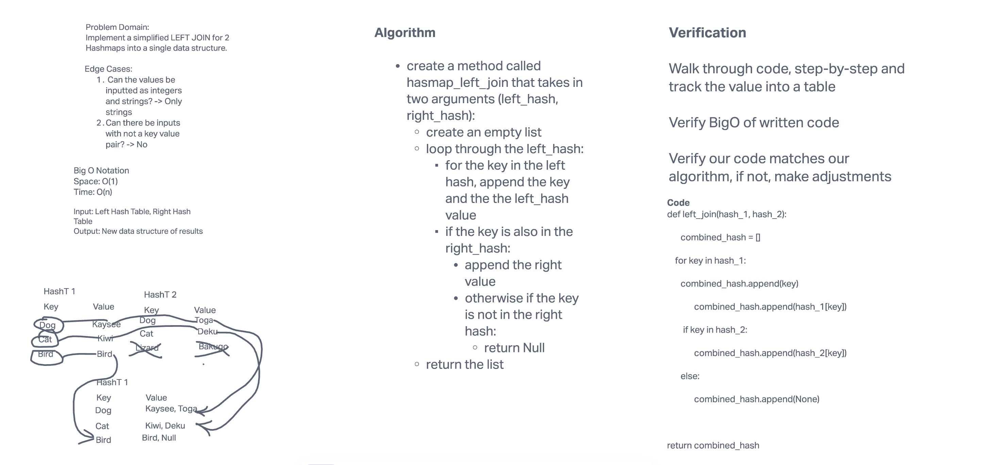

# Hashmap LEFT JOIN
- [PR Link]()

## Challenge
- Write a function that LEFT JOINs two hashmaps into a single data structure.

  * Write a function called left join
  * Arguments: two hash maps
    * The first parameter is a hashmap that has word strings as keys, and a synonym of the key as values.
    * The second parameter is a hashmap that has word strings as keys, and antonyms of the key as values.
  * Return: The returned data structure that holds the results is up to you. It doesn’t need to exactly match the output below, so long as it achieves the LEFT JOIN logic

NOTES:

- Combine the key and corresponding values (if they exist) into a new data structure according to LEFT JOIN logic.
- LEFT JOIN means all the values in the first hashmap are returned, and if values exist in the “right” hashmap, they are appended to the result row.
- If no values exist in the right hashmap, then some flavor of NULL should be appended to the result row.

## Approach & Efficiency
- Instead of writing all of my code first followed by testing, I decided write tests per new class method. This broke everything down into smaller steps which helped a lot

- BigO
  * Space: O(1)
  * Time: O(n)

## Solution

## Testing
- Write at least three test assertions for each method that you define.
- [Unit testing](tests/../../../tests/test_left_join.py)

## Credits and Colaborations
- Alex Payne
- Brandon Mizutani
- Connor Boyce
