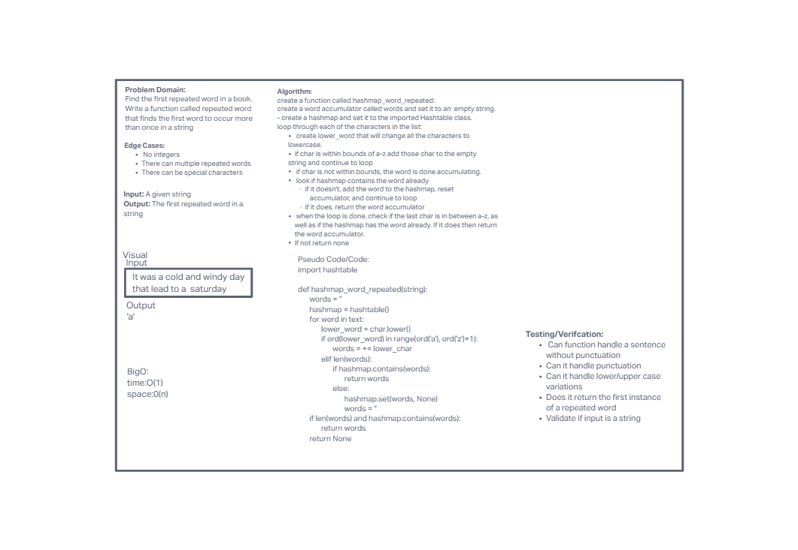

# Hashtables
- [PR Link](https://github.com/ponceedi000/data-structures-and-algorithms/pull/36)

## Challenge
- Find the first repeated word in a book. Utilize the Single-responsibility principle: any methods you write should be clean, reusable, abstract component parts to the whole challenge.

## Approach & Efficiency
- Instead of writing all of my code first followed by testing, I decided write tests per new class method. This broke everything down into smaller steps which helped a lot

- BigO
  * Space: O(1)
  * Time: O(n)

## Testing
- Write at least three test assertions for each method that you define.

## Credits and Colaborations
- Alex Payne
- Brandon Mizutani
- Connor Boyce
