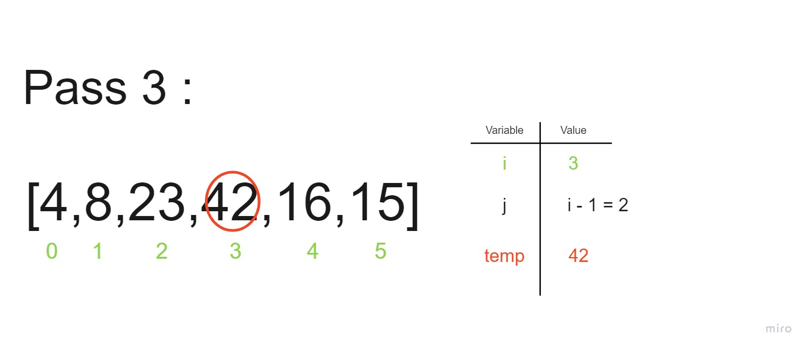

# Insertion Sort Blog by Eddie Ponce

## What is Insertion Sort?
> "Selection Sort is a sorting algorithm that traverses the array multiple times as it slowly builds out the sorting sequence. The traversal keeps track of the minimum value and places it in the front of the array which should be incrementally sorted." - GeeksforGeeks

Example: 

## Algorithm
1. Create a function that takes in a list as a param
2. Iterate through the given list
3. During each ideration, compare the current element (temp) to its predecessor
4. If the temp element is smaller than its predecessor, then compare it to the elements before
   1. Once it the temp element has found its correct index, move the greater elements one position to the right to make space for the swapped element

## Pseudocode


## Walk-Along
Sample List: `[8,4,23,42,16,15]`

- Pass 1


- Pass 2


- Pass 3


- Pass 4


- Pass 5


- Output

## Working Python Code
```
def insertionSort(list):

	for i in range(1, len(list)):

		temp = list[i]
		j = i-1

		while j >= 0 and temp < list[j] :

			list[j + 1] = list[j]
			j -= 1

		list[j + 1] = temp

```


## Working Tests
- `Screenshot of working tests`
## Efficiency | BigO
- Time
  * Explain why
- Space
  * Explain Why
