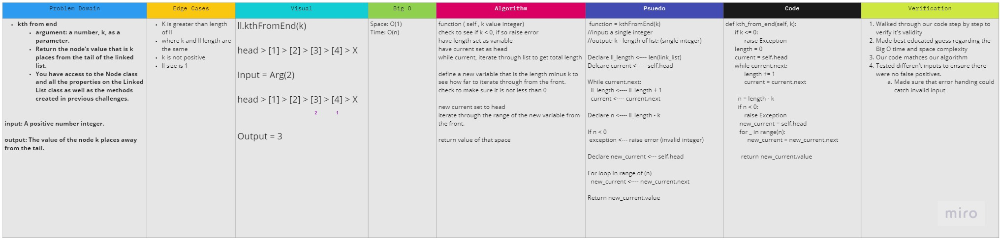

# Challenge Summary
- Write the following method for the Linked List class:

  * kth from end
  * argument: a number, k, as a parameter.
  * Return the node’s value that is k places from the tail of the linked list.
  * You have access to the Node class and all the properties on the Linked List class as well as the methods created in previous challenges.

## Whiteboard Process

## Approach & Efficiency
- ***Jordan Flemming*** and I, pair-programmed this coding challenge together on Dec 27th 2021
- We started off by writing out the Problem Domain to better understand what were solving. We then identified our input: a single integer, and our Output: Integer ( value of linked-list - k).
- To accomplish this output, we first drew a visual representation of our idea. The big idea is to find the length of our current list, subtract the value of k, and return the node.
- We then wrote out our algorithm which explains our thought process of makng this work. Next, we moved into Pseudo code to which helped a lot for the code portion of the whiteboard.
- Our algorithm felt really good after writing it. We conducted our unit testing (visually) and to provide good testing coverage.

## Unit Testing
1. Where k is greater than the length of the linked list
2. Where k and the length of the list are the same
3. Where k is not a positive integer
4. Where the linked list is of a size 1
5. “Happy Path” where k is not at the end, but somewhere in the middle of the linked list
