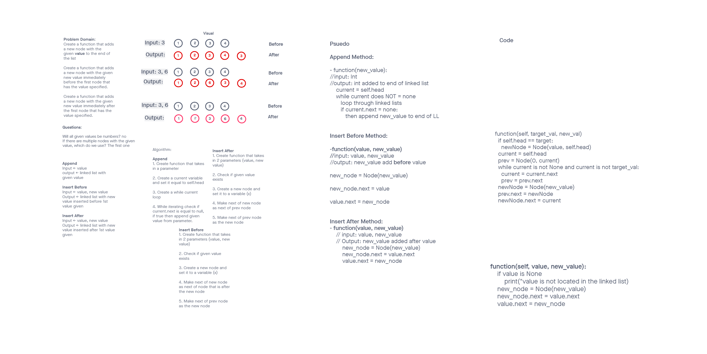

# Challenge Summary
- **Challenge Type**: Extending an Implementation
- append
  * arguments: new value
  * adds a new node with the given value to the end of the list
- insert before
  * arguments: value, new value
  * adds a new node with the given new value immediately before the first node that has the value specified

- insert after
  * arguments: value, new value
  * adds a new node with the given new value immediately after the first node that has the value specified

### Write tests to prove the following functionality:

1. Can successfully add a node to the end of the linked list
2. Can successfully add multiple nodes to the end of a linked list
3. Can successfully insert a node before a node located i the middle of a linked list
4. Can successfully insert a node before the first node of a linked list
5. Can successfully insert after a node in the middle of the linked list
6. Can successfully insert a node after the last node of the linked list

- [PR Link Here](https://github.com/ponceedi000/data-structures-and-algorithms/pull/21)
## Whiteboard Process

## Approach & Efficiency
<!-- What approach did you take? Why? What is the Big O space/time for this approach? -->

## Solution
<!-- Show how to run your code, and examples of it in action -->

## Time Log
- Started at: 6:30pm
- Ended at: pending
- Initial time expected to complete: 2 hours
- final time to complete: pending

## Credits and Colaborations
- Taylor White (Partner for Whiteboard process)

## Task Checklist

- [x] Top-level README “Table of Contents” is updated
- [x] README for this challenge is complete
  * [ ] Summary, Description, Approach & Efficiency, Solution
  * [x] Picture of whiteboard
  * [x] Link to code
- [ ] Feature tasks for this challenge are completed
- [ ] Unit tests written and passing
  * [ ] “Happy Path” - Expected outcome
  * [ ] Expected failure
  * [ ] Edge Case (if applicable/obvious)
