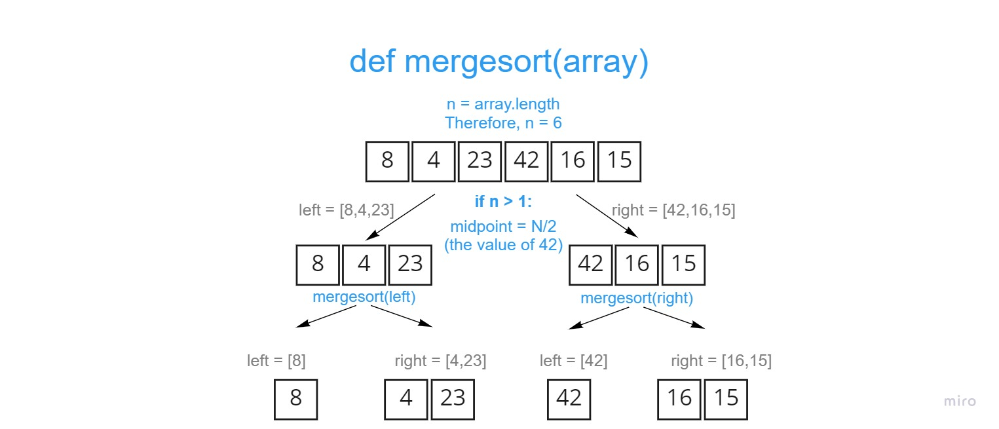

# Merge Sort Blog by Eddie Ponce

- [PR Link]()
## What is Merge Sort?
> "In computer science, merge sort (also commonly spelled as mergesort) is an efficient, general-purpose, and comparison-based sorting algorithm. Most implementations produce a stable sort, which means that the order of equal elements is the same in the input and output. Merge sort is a divide and conquer algorithm that was invented by John von Neumann in 1945. A detailed description and analysis of bottom-up merge sort appeared in a report by Goldstine and von Neumann as early as 1948." - [GeeksforGeeks](https://en.wikipedia.org/wiki/Merge_sort)

Example: 

## Algorithm
1. Find the middle point to divide the array into two halves
2. Call mergeSort for first half
3. Call mergeSort for second half
4. Merge the two halves sorted in step 2 and 3

## Pseudocode
```
ALGORITHM Mergesort(arr)
    DECLARE n <-- arr.length

    if n > 1
      DECLARE mid <-- n/2
      DECLARE left <-- arr[0...mid]
      DECLARE right <-- arr[mid...n]
      // sort the left side
      Mergesort(left)
      // sort the right side
      Mergesort(right)
      // merge the sorted left and right sides together
      Merge(left, right, arr)

ALGORITHM Merge(left, right, arr)
    DECLARE i <-- 0
    DECLARE j <-- 0
    DECLARE k <-- 0

    while i < left.length && j < right.length
        if left[i] <= right[j]
            arr[k] <-- left[i]
            i <-- i + 1
        else
            arr[k] <-- right[j]
            j <-- j + 1

        k <-- k + 1

    if i = left.length
       set remaining entries in arr to remaining values in right
    else
       set remaining entries in arr to remaining values in left
```


## Walk-Along
Sample List: `[8,4,23,42,16,15]`

- Pass 1


- Pass 2


- Pass 3


## Working Python Code
```
def merge_sort(list):
    n = len(list)

    if n > 1:
        mid = n // 2
        left = list[0:mid]
        right = list[mid:n]
        merge_sort(left)
        merge_sort(right)
        merge(left, right, list)

def merge(left, right, list):
    i = j = k = 0

    while i < len(left) and j < len(right):
        if left[i] <= right[j]:
            list[k] = left[i]
            i += 1
        else:
            list[k] = right[j]
            j += 1
        k += 1

    if i == len(left):
        while j < len(right):
            list[k] = right[j]
            j += 1
            k += 1
    else:
        while i < len(left):
            list[k] = left[i]
            i += 1
            k += 1

```


## Working Tests
- [](img/test.JPG)
## Efficiency | BigO
- Time: O(nLogn)
 
- Space: O(n)
