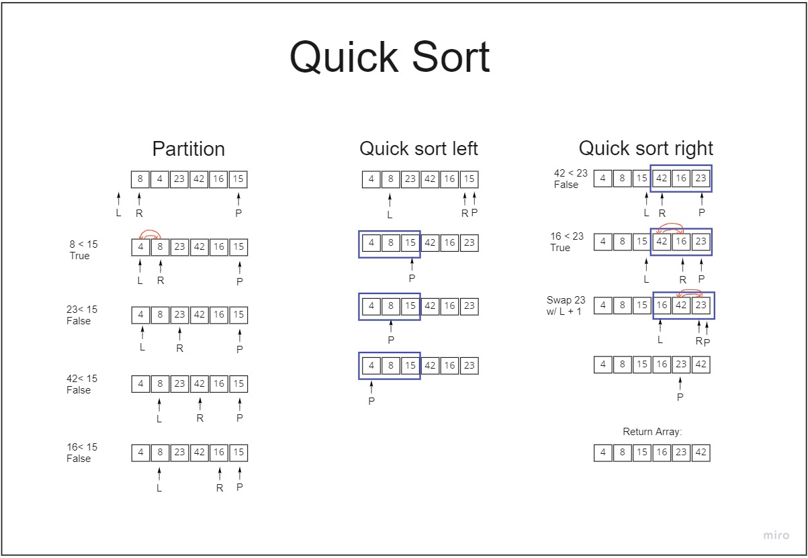
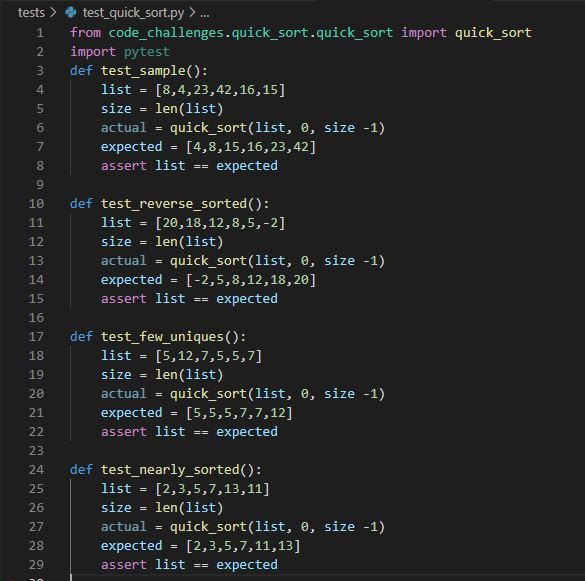
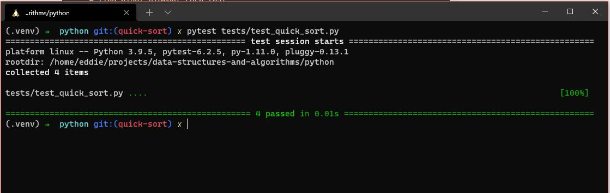

# Quick Sort Blog by Eddie Ponce

- [PR Link]()
## What is Merge Sort?


Example: 

## Algorithm
1. Pick first element as pivot
2. pick last element as pivot
3. pick a random element as pivot
4. pick median as pivot

## Pseudocode
```
ALGORITHM QuickSort(arr, left, right)
    if left < right
        // Partition the array by setting the position of the pivot value
        DEFINE position <-- Partition(arr, left, right)
        // Sort the left
        QuickSort(arr, left, position - 1)
        // Sort the right
        QuickSort(arr, position + 1, right)

ALGORITHM Partition(arr, left, right)
    // set a pivot value as a point of reference
    DEFINE pivot <-- arr[right]
    // create a variable to track the largest index of numbers lower than the defined pivot
    DEFINE low <-- left - 1
    for i <- left to right do
        if arr[i] <= pivot
            low++
            Swap(arr, i, low)

     // place the value of the pivot location in the middle.
     // all numbers smaller than the pivot are on the left, larger on the right.
     Swap(arr, right, low + 1)
    // return the pivot index point
     return low + 1

ALGORITHM Swap(arr, i, low)
    DEFINE temp;
    temp <-- arr[i]
    arr[i] <-- arr[low]
    arr[low] <-- temp
```


## Walk-Along
Sample List: `[8,4,23,42,16,15]`



## Working Python Code
```
def partition(array, low, high):
  pivot = array[high]
  i = low - 1

  for j in range(low, high):
    if array[j] <= pivot:
      i = i + 1
      (array[i], array[j]) = (array[j], array[i])

  (array[i + 1], array[high]) = (array[high], array[i + 1])

  return i + 1

def quickSort(array, low, high):
  if low < high:
    pi = partition(array, low, high)
    quickSort(array, low, pi - 1)
    quickSort(array, pi + 1, high)

```


## Working Tests
- 
- 
## Efficiency | BigO
- Time: O(n2)

- Space: O(log n)
