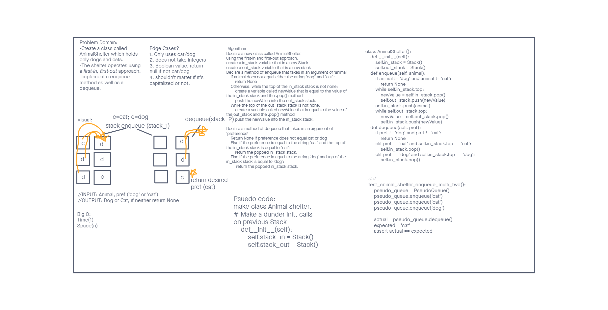

- [PR Link Here]()

# Animal Shelter

## White Board

## Challenge
- Create a class called AnimalShelter which holds only dogs and cats.
- The shelter operates using a first-in, first-out approach.
- Implement the following methods:
  * enqueue
    * Arguments: animal
    * animal can be either a dog or a cat object.
  * dequeue
    * Arguments: pref
    * pref can be either "dog" or "cat"
  * Return: either a dog or a cat, based on preference.
    * If pref is not "dog" or "cat" then return null.

### Write tests to prove the following functionality:
[tests](stack_and_queues/tests/../../../../tests/test_stack_queue_animal_shelter.py)
- Note, my computer was having a tough time running my testing file but they worked in Replit. I'm not sure if it'll work on your end.

## Approach & Efficiency
- Created whiteboard before diving into code:
  * Identified problem domain, edge cases, input/output, created visualization demo, and wrote algo.
- Used our standard stack implementation
- Wrote each methods
- Wrote tests to verify functionality

### Time Log

- Start Time: 7:30pm
- End Time: 9:45pm
## Credits and Colaborations
- Brandon Mizutani
- Alex Payne
- Connor Boyce

## Resources
- [Stacks and Queues in Python](https://pynote.readthedocs.io/en/latest/DataTypes/Stack_Queue.html)
- [Queue using Stacks](https://www.geeksforgeeks.org/queue-using-stacks/)
- [Implement A Queue using Two Stacks Python](https://stackoverflow.com/questions/22430803/implement-a-queue-using-two-stacks-python)

