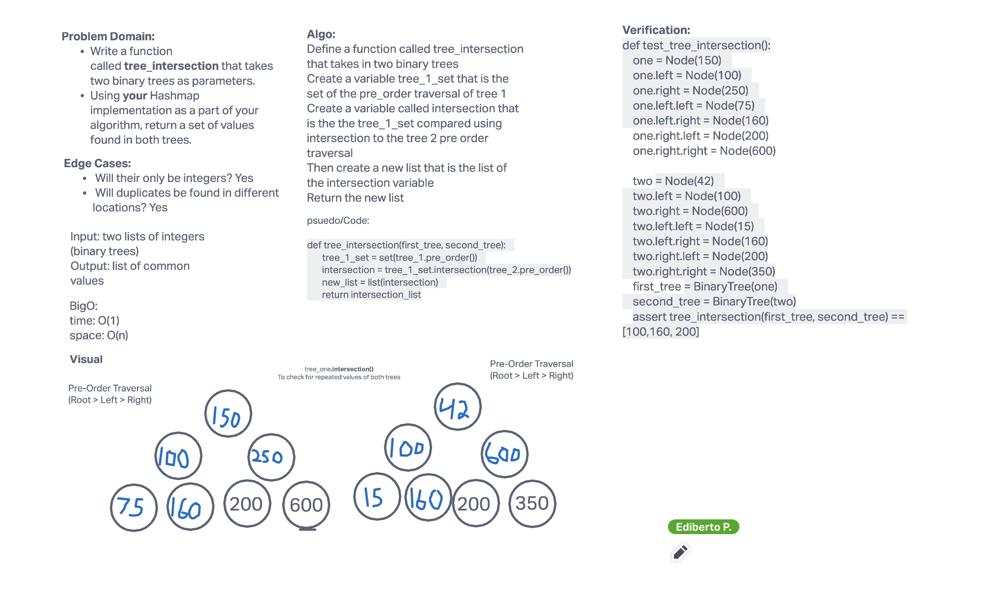

# Hashtables
- [PR Link](https://github.com/ponceedi000/data-structures-and-algorithms/pull/37)

## Challenge
- Find common values in 2 binary trees
- Write a function called tree_intersection that takes two binary trees as parameters.
- Using your Hashmap implementation as a part of your algorithm, return a set of values found in both trees.

## Whiteboard Process

## Approach & Efficiency
- Come with a way to avoid "re-inventing the wheel" and use our Node & Binary Tree implementation to take care of the heavy work.
- Find out if there are any built-in methods that can help with comparing our two different trees
- BigO
  * Space: O(1)
  * Time: O(n)
## Solution

[Click to see solution](tree_intersection.py)
## Credits and Colaborations
- Alex Payne
- Brandon Mizutani
- Connor Boyce

- [Python Set intersection() Method - W3 Schools](https://www.w3schools.com/python/ref_set_intersection.asp)
- [Python Sets - W3 Schools](https://www.w3schools.com/python/python_sets.asp)
