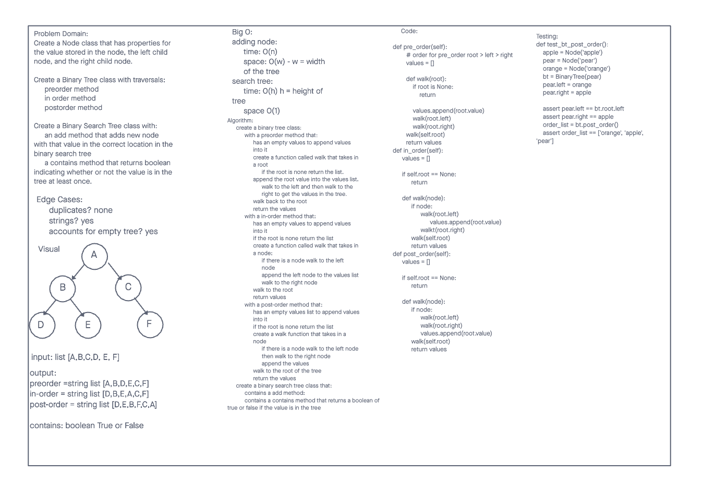
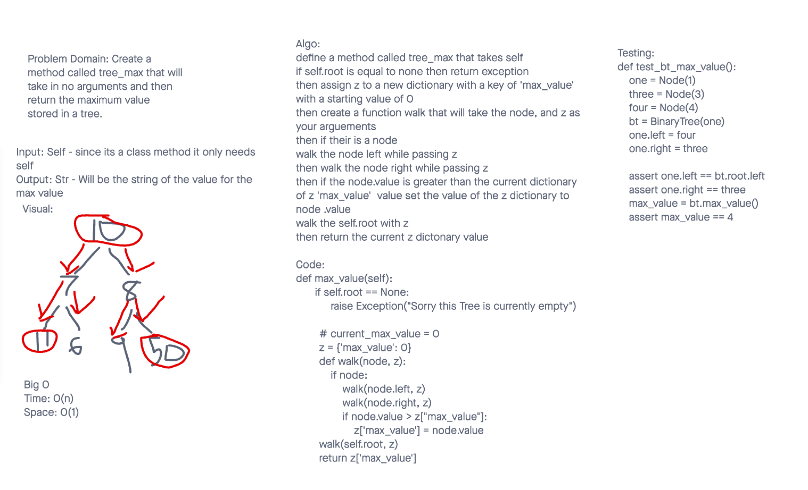
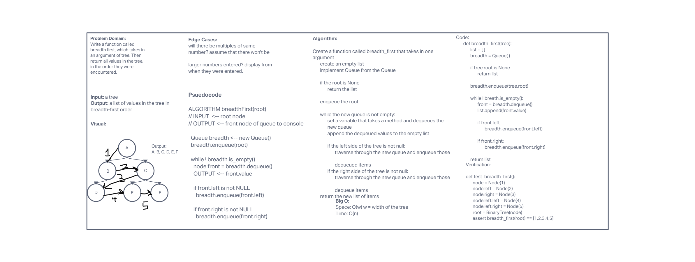
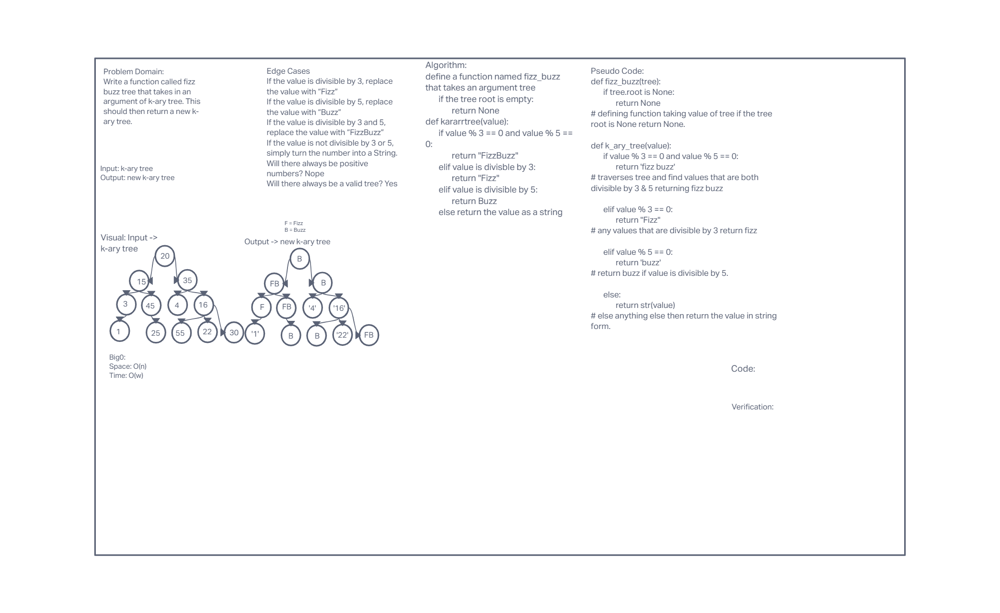

- [PR Link Here](https://github.com/ponceedi000/data-structures-and-algorithms/pull/28)
- [tree-max](https://github.com/ponceedi000/data-structures-and-algorithms/pull/29)

# Binary Tree and BST Implementation

## White Board

## Challenge
**Challenge Type: New Implementation**
- **Node**
  * Create a Node class that has properties for the value stored in the node, the left child node, and the right child node.
- **Binary Tree**
  * Create a Binary Tree class
    * Define a method for each of the depth first traversals:
      * pre order
      * in order
      * post order which returns an array of the values, ordered appropriately.
  * Any exceptions or errors that come from your code should be semantic, capture-able errors. For example, rather than a default error thrown by your language, your code should raise/throw a custom, semantic error that describes what went wrong in calling the methods you wrote for this lab.
- **Binary Search Tree**
  * Create a Binary Search Tree class
    * This class should be a sub-class (or your languages equivalent) of the Binary Tree Class, with the following additional methods:
  * Add
    * Arguments: value
    * Return: nothing
    * Adds a new node with that value in the correct location in the binary search tree.
  * Contains
    * Argument: value
    * Returns: boolean indicating whether or not the value is in the tree at least once.

- **Write tests to prove the following functionality:**

  1. Can successfully instantiate an empty tree
  2. Can successfully instantiate a tree with a single root node
  3. For a Binary Search Tree, can successfully add a left child and right child properly to a node
  4. Can successfully return a collection from a preorder traversal
  5. Can successfully return a collection from an inorder traversal
  6. Can successfully return a collection from a postorder traversal
  7. Returns true
     * false for the contains method, given an existing or non-existing node value

## PyTest:
[Click here to find tests](tests/../../../tests/test_binary_tree.py)

## Approach & Efficiency
- Created whiteboard before diving into code:
  * Identified problem domain, edge cases, input/output, created visualization demo, and wrote algo.
- Wrote traversal methods
- Wrote tests to verify method's functionality

## Approach & Efficiency
- In Order: The left subtree is visited first, then the root and later the right sub-tree.
- Pre Order: The root node is visited first, then the left subtree and finally the right subtree.
- Post Order: First, we traverse the left subtree, then the right subtree and finally the root node.
- Find Max:

## Credits and Colaborations
- Brandon Mizutani
- Alex Payne

## Resources
- [Python - Binary Tree](https://www.tutorialspoint.com/python_data_structure/python_binary_tree.htm)
- [Construct a Binary Tree from Postorder and Inorder](https://www.geeksforgeeks.org/construct-a-binary-tree-from-postorder-and-inorder/)
- [Python program to insert an element into binary search tree](https://cppsecrets.com/users/203121971151041199711011610410311710010510397109971081089764103109971051084699111109/Python-program-to-insert-an-element-into-binary-search-tree.php)

***

# Code Challenge 17
[PR Link](https://github.com/ponceedi000/data-structures-and-algorithms/pull/30)

## White Board:

## Approach & Efficiency
- Created whiteboard before diving into code:
  * Identified problem domain, edge cases, input/output, created visualization demo, and wrote algo.

## Credits and Colaborations
- Brandon Mizutani
- Connor Boyce

***

# Code Challenge 18
[PR Link](https://github.com/ponceedi000/data-structures-and-algorithms/pull/31)

## White Board:

## Approach & Efficiency
- Created whiteboard before diving into code:
  * Identified problem domain, edge cases, input/output, created visualization demo, and wrote algo.

## Credits and Colaborations
- Brandon Mizutani
- Connor Boyce
- Alexa Payne
- Taylor White

## Resources
[Construct the full k-ary tree from its preorder traversal](https://www.geeksforgeeks.org/construct-full-k-ary-tree-preorder-traversal/)
[Trees](https://codefellows.github.io/common_curriculum/data_structures_and_algorithms/Code_401/class-15/resources/Trees.html)

