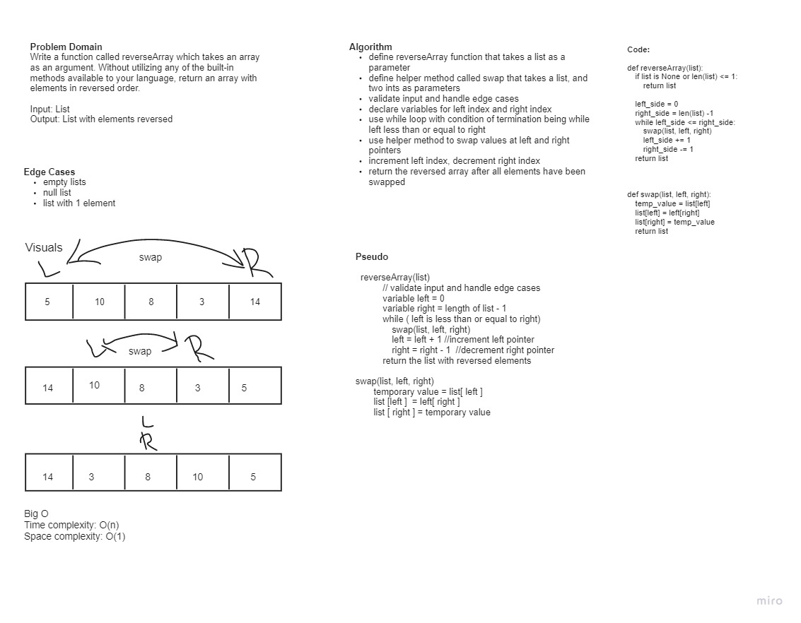

# Reverse an Array
Write a function called reverseArray which takes an array as an argument. Without utilizing any of the built-in methods available to your language, return an array with elements in reversed order.

## Whiteboard Process

## Approach & Efficiency

- ***Isaiah Burkes*** and I, pair-programmed this coding challenge together on Dec 6th 2021
- We started off by writing out the Problem Domain to better understand what were solving. We then identified our input: a List, and our Output: List with elements reversed.
- To accomplish this output, we first drew a visual representation of our idea. The big idea is to swap to values from the left side of the list with right side of the list IOT create a 'reverse' effect.
- We then wrote out our algorithm which explains our thought process of makng this work. Next, we moved into Pseudo code to which help a lot for the code portion of the whiteboard.
- Our algorithm felt really good at this point so lastly, we created the code.
